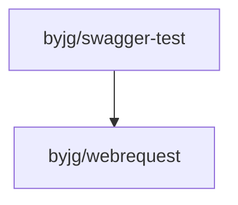

[](https://github.com/byjg/php-swagger-test/actions/workflows/phpunit.yml)
[](http://opensource.byjg.com)
[](https://github.com/byjg/php-swagger-test/)
[](https://opensource.byjg.com/opensource/licensing.html)
[](https://github.com/byjg/php-swagger-test/releases/)
[](https://scrutinizer-ci.com/g/byjg/php-swagger-test/?branch=master)

# PHP Swagger Test

A set of tools for testing your REST calls based on the OpenApi specification using PHPUnit.
Currently, this library supports the OpenApi specifications `2.0` (formerly swagger) and `3.0`.
Some features like callbacks, links and references to external documents/objects weren't implemented.

PHP Swagger Test can help you to test your REST Api. You can use this tool both for Unit Tests or Functional Tests.

This tool reads a previously Swagger JSON file (not YAML) and enables you to test the request and response.
You can use the tool "[https://github.com/zircote/swagger-php](https://github.com/zircote/swagger-php)" for creating the JSON file when you are developing your
rest API.

The ApiTestCase's assertion process is based on throwing exceptions if some validation or test failed.

## Use cases for PHP Swagger test

You can use the Swagger Test library as:

- [Functional test cases](docs/functional-tests.md)
- [Contract test cases](docs/contract-tests.md)
- [Runtime parameters validator](docs/runtime-parameters-validator.md)
- [Mocking Requests and Validate your specification](docs/mock-requests.md)

Who is using this library?

- [ByJG PHP Rest Reference Architecture](https://github.com/byjg/php-rest-reference-architecture)
- [Laravel Swagger Test](https://github.com/pionl/laravel-swagger-test)

## Install

```bash
composer require "byjg/swagger-test"
```

## Tests

```bash
SPEC=swagger php -S 127.0.0.1:8080 tests/rest/app.php &
SPEC=openapi php -S 127.0.0.1:8081 tests/rest/app.php &
vendor/bin/phpunit
```

## Questions?

Please raise your issue on [Github issue](https://github.com/byjg/php-swagger-test/issues).

## References

This project uses the [byjg/webrequest](https://github.com/byjg/webrequest) component.
It implements the PSR-7 specification, and a HttpClient / MockClient to do the requests.
Check it out to get more information.

## Dependencies


----
[Open source ByJG](http://opensource.byjg.com)