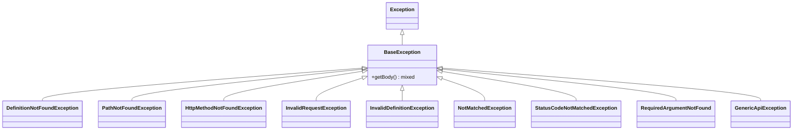

# Exception Handling

PHP Swagger Test uses exceptions to communicate validation failures and errors. Understanding the exception hierarchy and knowing when each exception is thrown will help you debug issues and handle errors appropriately.

## Exception Hierarchy

All exceptions extend from `BaseException`, which provides additional context through the `getBody()` method:



## BaseException

The base class for all library exceptions.

**Special Feature:** Provides a `getBody()` method that returns the request/response body that caused the error.

```php
<?php
use ByJG\ApiTools\Exception\BaseException;

try {
    $this->sendRequest($request);
} catch (BaseException $e) {
    // Get the actual body that failed validation
    $failedBody = $e->getBody();

    echo $e->getMessage();  // Human-readable error
    print_r($failedBody);   // The data that caused the error
}
```

---

## Request/Path Exceptions

### PathNotFoundException

**Thrown when:** The requested path doesn't exist in the OpenAPI specification.

**Common causes:**
- Path not defined in the spec
- Missing leading slash
- Base path included incorrectly

**Example:**

```php
// OpenAPI spec has: /pet/{petId}
// But you're testing: /pets/1  (wrong path)

$request = new ApiRequester();
$request->withMethod('GET')->withPath('/pets/1');  // ❌ Wrong

try {
    $this->sendRequest($request);
} catch (\ByJG\ApiTools\Exception\PathNotFoundException $e) {
    // Path "/pets/1" not found
    echo $e->getMessage();
}

// Fix: Use correct path
$request->withPath('/pet/1');  // ✅ Correct
```

### HttpMethodNotFoundException

**Thrown when:** The HTTP method doesn't exist for a given path in the specification.

**Common causes:**
- Wrong HTTP method (GET instead of POST)
- Method not defined in the spec for that path

**Example:**

```php
// OpenAPI spec has: POST /pet but you're using GET

$request = new ApiRequester();
$request->withMethod('GET')->withPath('/pet');  // ❌ Wrong method

try {
    $this->sendRequest($request);
} catch (\ByJG\ApiTools\Exception\HttpMethodNotFoundException $e) {
    // The http method 'get' not found in '/pet'
    echo $e->getMessage();
}

// Fix: Use correct method
$request->withMethod('POST')->withPath('/pet');  // ✅ Correct
```

---

## Definition Exceptions

### DefinitionNotFoundException

**Thrown when:** A referenced schema definition (via `$ref`) cannot be found.

**Common causes:**
- Invalid `$ref` path
- Missing definition in `definitions` (Swagger 2.0) or `components/schemas` (OpenAPI 3.0)
- Typo in definition name

**Example:**

```yaml
# OpenAPI spec has a broken reference
components:
  schemas:
    Pet:
      type: object
      properties:
        category:
          $ref: '#/components/schemas/Categoryy'  # Typo: should be 'Category'
```

```php
try {
    $this->sendRequest($request);
} catch (\ByJG\ApiTools\Exception\DefinitionNotFoundException $e) {
    // Not find reference #/components/schemas/Categoryy
    echo $e->getMessage();
}
```

**Fix:** Correct the reference in your OpenAPI specification.

### InvalidDefinitionException

**Thrown when:** The OpenAPI specification has structural problems or invalid definitions.

**Common causes:**
- Malformed `$ref` paths
- Invalid schema structure
- Missing required schema properties

**Example:**

```yaml
# Invalid $ref format
components:
  parameters:
    limitParam:
      $ref: 'components/parameters/limit'  # ❌ Wrong format
```

```php
try {
    $this->sendRequest($request);
} catch (\ByJG\ApiTools\Exception\InvalidDefinitionException $e) {
    // Not get the reference in the expected format #/components/parameters/<NAME>
    echo $e->getMessage();
}
```

**Fix:** Use proper `$ref` format: `#/components/parameters/limit`

---

## Request/Response Validation Exceptions

### NotMatchedException

**Thrown when:** Request or response data doesn't match the OpenAPI specification.

**Common causes:**
- Wrong data type (string instead of integer)
- Value doesn't match pattern/enum
- Unexpected properties (when `additionalProperties: false`)
- Missing properties in response
- Value doesn't match constraints (min/max, minLength/maxLength)

**Examples:**

#### Type Mismatch

```php
// Spec expects integer, you send string
$request = new ApiRequester();
$request
    ->withMethod('POST')
    ->withPath('/pet')
    ->withRequestBody([
        'id' => 'abc',  // ❌ Should be integer
        'name' => 'Fluffy'
    ]);

try {
    $this->sendRequest($request);
} catch (\ByJG\ApiTools\Exception\NotMatchedException $e) {
    // Value 'abc' in 'id' is not integer
    echo $e->getMessage();
    print_r($e->getBody());  // Shows the full request body
}
```

#### Pattern Mismatch

```php
// Spec has pattern: '^[a-z]+$' (only lowercase)
$request = new ApiRequester();
$request
    ->withMethod('POST')
    ->withPath('/pet')
    ->withRequestBody([
        'name' => 'Fluffy123'  // ❌ Contains numbers
    ]);

try {
    $this->sendRequest($request);
} catch (\ByJG\ApiTools\Exception\NotMatchedException $e) {
    // Value 'Fluffy123' in 'name' not matched in pattern
    echo $e->getMessage();
}
```

#### Enum Mismatch

```php
// Spec has enum: ['available', 'pending', 'sold']
$request = new ApiRequester();
$request
    ->withMethod('POST')
    ->withPath('/pet')
    ->withRequestBody([
        'status' => 'unknown'  // ❌ Not in enum
    ]);

try {
    $this->sendRequest($request);
} catch (\ByJG\ApiTools\Exception\NotMatchedException $e) {
    // Value 'unknown' in 'status' not matched in ENUM
    echo $e->getMessage();
}
```

#### Additional Properties

```php
// Spec has additionalProperties: false
$request = new ApiRequester();
$request
    ->withMethod('POST')
    ->withPath('/pet')
    ->withRequestBody([
        'name' => 'Fluffy',
        'extraField' => 'value'  // ❌ Not defined in spec
    ]);

try {
    $this->sendRequest($request);
} catch (\ByJG\ApiTools\Exception\NotMatchedException $e) {
    // Additional properties are not allowed
    echo $e->getMessage();
}
```

#### Header Not Found

```php
$request = new ApiRequester();
$request
    ->withMethod('GET')
    ->withPath('/pet/1')
    ->expectHeaderContains('X-Custom-Header', 'value');

try {
    $this->sendRequest($request);
} catch (\ByJG\ApiTools\Exception\NotMatchedException $e) {
    // Does not exists header 'X-Custom-Header' with value 'value'
    echo $e->getMessage();
}
```

#### Body Content Missing

```php
$request = new ApiRequester();
$request
    ->withMethod('GET')
    ->withPath('/pet/1')
    ->expectBodyContains('Fluffy');

try {
    $this->sendRequest($request);
} catch (\ByJG\ApiTools\Exception\NotMatchedException $e) {
    // Body does not contain 'Fluffy'
    echo $e->getMessage();
}
```

### RequiredArgumentNotFound

**Thrown when:** A required property is missing from the request or response.

**Example:**

```php
// Spec requires 'name' and 'photoUrls'
$request = new ApiRequester();
$request
    ->withMethod('POST')
    ->withPath('/pet')
    ->withRequestBody([
        'name' => 'Fluffy'
        // ❌ Missing 'photoUrls'
    ]);

try {
    $this->sendRequest($request);
} catch (\ByJG\ApiTools\Exception\RequiredArgumentNotFound $e) {
    // The property 'photoUrls' is required but not found
    echo $e->getMessage();
}
```

### StatusCodeNotMatchedException

**Thrown when:** The actual HTTP status code doesn't match the expected status.

**Example:**

```php
$request = new ApiRequester();
$request
    ->withMethod('GET')
    ->withPath('/pet/999999')
    ->expectStatus(200);  // Expecting success

try {
    $this->sendRequest($request);
} catch (\ByJG\ApiTools\Exception\StatusCodeNotMatchedException $e) {
    // Status code not matched: Expected 200, got 404
    echo $e->getMessage();
    print_r($e->getBody());  // Shows the error response body
}
```

### InvalidRequestException

**Thrown when:** The request is malformed or invalid.

**Common causes:**
- Empty path
- Invalid Content-Type
- Malformed request structure
- Invalid path parameters

**Example:**

```php
$request = new ApiRequester();
$request
    ->withMethod('POST')
    ->withPath('/pet')
    ->withRequestBody('invalid data')
    ->withRequestHeader(['Content-Type' => 'application/xml']);  // ❌ Unsupported

try {
    $this->sendRequest($request);
} catch (\ByJG\ApiTools\Exception\InvalidRequestException $e) {
    // Cannot handle Content Type 'application/xml'
    echo $e->getMessage();
}
```

---

## Generic Exceptions

### GenericApiException

**Thrown when:** A general API validation error occurs that doesn't fit other categories.

This is a catch-all exception for unexpected validation errors.

```php
try {
    $this->sendRequest($request);
} catch (\ByJG\ApiTools\Exception\GenericApiException $e) {
    echo $e->getMessage();
}
```

---

## Best Practices for Exception Handling

### 1. Catch Specific Exceptions First

```php
use ByJG\ApiTools\Exception\PathNotFoundException;
use ByJG\ApiTools\Exception\StatusCodeNotMatchedException;
use ByJG\ApiTools\Exception\NotMatchedException;
use ByJG\ApiTools\Exception\BaseException;

try {
    $this->sendRequest($request);
} catch (PathNotFoundException $e) {
    // Handle missing path - maybe your spec is outdated
    $this->markTestSkipped("Path not in spec: " . $e->getMessage());
} catch (StatusCodeNotMatchedException $e) {
    // Handle unexpected status code
    echo "Expected different status. Response: " . json_encode($e->getBody());
    throw $e;
} catch (NotMatchedException $e) {
    // Handle validation failures
    echo "Validation failed: " . $e->getMessage();
    echo "Body: " . json_encode($e->getBody());
    throw $e;
} catch (BaseException $e) {
    // Catch all other library exceptions
    throw $e;
}
```

### 2. Use getBody() for Debugging

The `getBody()` method on `BaseException` provides the actual data that caused the error:

```php
try {
    $this->sendRequest($request);
} catch (\ByJG\ApiTools\Exception\NotMatchedException $e) {
    // Log the error with full context
    error_log("Validation Error: " . $e->getMessage());
    error_log("Failed Body: " . json_encode($e->getBody(), JSON_PRETTY_PRINT));

    // Or save to file for analysis
    file_put_contents(
        'failed-request.json',
        json_encode($e->getBody(), JSON_PRETTY_PRINT)
    );
}
```

### 3. Custom Error Handling in Tests

```php
class MyApiTest extends ApiTestCase
{
    protected function handleValidationError(\ByJG\ApiTools\Exception\BaseException $e): void
    {
        // Custom logging
        $this->logger->error($e->getMessage(), [
            'body' => $e->getBody(),
            'trace' => $e->getTraceAsString()
        ]);

        // Take screenshot for UI tests
        if ($this->isUiTest) {
            $this->takeScreenshot('validation-error-' . time());
        }
    }

    public function testApiEndpoint(): void
    {
        try {
            $request = new ApiRequester();
            $request->withMethod('GET')->withPath('/pet/1');
            $this->sendRequest($request);
        } catch (\ByJG\ApiTools\Exception\BaseException $e) {
            $this->handleValidationError($e);
            throw $e;
        }
    }
}
```

### 4. Graceful Degradation in Production

When using runtime validation in production, handle exceptions gracefully:

```php
use ByJG\ApiTools\Base\Schema;

class ApiController
{
    private Schema $schema;

    public function handleRequest($requestData): Response
    {
        try {
            // Validate request against OpenAPI spec
            $bodyRequestDef = $this->schema->getRequestParameters('/api/users', 'POST');
            $bodyRequestDef->match($requestData);

            // Process valid request
            $result = $this->processRequest($requestData);

            // Validate response
            $bodyResponseDef = $this->schema->getResponseParameters('/api/users', 'POST', 200);
            $bodyResponseDef->match($result);

            return new Response($result, 200);

        } catch (\ByJG\ApiTools\Exception\RequiredArgumentNotFound $e) {
            return new Response([
                'error' => 'Missing required field',
                'message' => $e->getMessage()
            ], 400);

        } catch (\ByJG\ApiTools\Exception\NotMatchedException $e) {
            return new Response([
                'error' => 'Invalid request data',
                'message' => $e->getMessage()
            ], 400);

        } catch (\ByJG\ApiTools\Exception\BaseException $e) {
            // Log unexpected errors
            error_log("API Validation Error: " . $e->getMessage());

            return new Response([
                'error' => 'Request validation failed'
            ], 400);
        }
    }
}
```

---

## Exception Quick Reference

| Exception | When Thrown | HTTP Status Hint |
|-----------|-------------|------------------|
| `PathNotFoundException` | Path not in spec | 404 (likely) |
| `HttpMethodNotFoundException` | Method not allowed for path | 405 (likely) |
| `DefinitionNotFoundException` | Schema reference not found | 500 (spec error) |
| `InvalidDefinitionException` | Spec structure invalid | 500 (spec error) |
| `NotMatchedException` | Data doesn't match schema | 400 (validation) |
| `RequiredArgumentNotFound` | Missing required field | 400 (validation) |
| `StatusCodeNotMatchedException` | Wrong status code | N/A |
| `InvalidRequestException` | Malformed request | 400 (client error) |
| `GenericApiException` | General API error | Varies |

---

## Related Documentation

- [Troubleshooting Guide](troubleshooting.md) - Common errors and solutions
- [Functional Tests](functional-tests.md) - Testing with sendRequest()
- [Runtime Parameters Validator](runtime-parameters-validator.md) - Using validation in production
